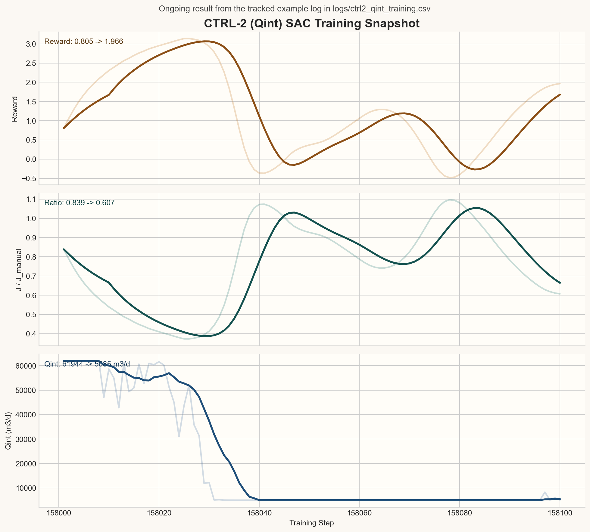

# BSM2 MARL

Multi-agent reinforcement learning for wastewater treatment control in the BSM2 benchmark.

This repository is a curated public snapshot of my MSc thesis work in Engineering Physics at the University of Coimbra. It combines MATLAB/Simulink process simulation with Python reinforcement learning agents to explore learned control policies for a wastewater treatment plant.

## Why This Project Matters

- It tackles a real control problem rather than a toy RL environment.
- It integrates MATLAB/Simulink process dynamics with Python learning code.
- It treats control as an engineering problem with operating-cost and effluent-quality tradeoffs.
- It is being developed as a thesis project with a path from single-agent SAC to multi-agent coordination.

## Current Status

| Area | Status |
|---|---|
| MATLAB-Python communication bridge | Implemented |
| Shared reward and training utilities | Implemented |
| CTRL-2 internal recirculation agent (SAC) | Implemented |
| Baseline proportional controller | Implemented |
| Correlation-based variable selection workflow | Documented |
| CTRL-1 external carbon agent | In progress locally |
| Full 4-agent MARL training | Planned |
| G2ANet-style communication layer | Planned |

## System Architecture

```text
MATLAB / Simulink (BSM2)                Python
------------------------                ----------------------------
Closed-loop plant simulation   <---->   RL or baseline controller
15-minute process timestep              Reward computation
State export to CSV                     Action generation
Action import from CSV                  Checkpoint and log writing
```

The plant simulation runs in MATLAB/Simulink while the controller runs in Python. The two sides communicate through lightweight CSV exchange plus runtime flag files.

## Control Scope

| Controller | Manipulated variable | Status |
|---|---|---|
| CTRL-1 | `Qec` external carbon dosing | In progress |
| CTRL-2 | `Qint` internal recirculation | Implemented with SAC |
| CTRL-3 | `DOref` dissolved oxygen setpoint | Planned |
| CTRL-4 | `Qw` waste sludge flow | Planned |

The current public implementation focuses on CTRL-2. Variable selection was guided by Pearson correlation analysis on BSM2 operating data.

## Reward Formulation

The reward follows the operating-cost structure used in Nam et al. (2023):

```text
J(t) = 200 * EQI + 40 * AE + 3 * PE + 1 * EC
r(t) = -5 * (J_RL / J_manual) + 5
r(t) >= -1
```

Where:
- `EQI` is the effluent quality index proxy.
- `AE` is aeration energy.
- `PE` is pumping energy, including the contribution from `Qint`.
- `EC` is external carbon consumption.

## What Is In This Repo

- [`agents/`](./agents): Python controllers, including the current SAC controller for `Qint`.
- [`core/`](./core): shared RL infrastructure such as networks, replay buffer, and reward calculation.
- [`matlab/`](./matlab): orchestration scripts for stepping BSM2 and exchanging data with Python.
- [`docs/`](./docs): analysis notes and correlation-study material.
- [`comms/`](./comms): example runtime exchange files used by the MATLAB-Python bridge.
- [`logs/`](./logs): sample training log artifacts.
- [`checkpoints/`](./checkpoints): sample trained model artifact.
- [`results/`](./results): generated portfolio-ready figures and summaries from tracked example logs.
- [`PROJECT_STRUCTURE.md`](./PROJECT_STRUCTURE.md): concise map of the repository layout.

## Key Technical Decisions

- Soft Actor-Critic is used first on a single control loop before moving to multi-agent coordination.
- The bridge uses simple file-based synchronization so MATLAB and Python remain loosely coupled.
- The reward is centered on process-quality and operating-cost terms rather than abstract RL signals.
- Runtime artifacts are kept lightweight and inspectable for debugging.

## Running The Current CTRL-2 Pipeline

Requirements:
- Python 3
- MATLAB/Simulink with the BSM2 closed-loop model available locally

Install Python dependencies:

```bash
pip install -r requirements.txt
```

Run the controller:

```bash
python agents/ctrl_sac_qint.py
```

Then start the MATLAB orchestrator:

```matlab
run matlab/RL_main_episodes.m
```

## Ongoing Results

The repository includes a small tracked training snapshot for the current CTRL-2 SAC controller. It is not a final benchmark, but it already shows meaningful movement away from the default high-recirculation setting.



From the currently tracked example log:

- reward increased from `0.805` to `1.966`
- `J / J_manual` decreased from `0.839` to `0.607`
- `Qint` moved from `61944` to about `5085` m3/d

See [`results/ctrl2_qint_summary.md`](./results/ctrl2_qint_summary.md) for the generated summary.

## Notes For Reviewers

- This public repository is intended to show working thesis progress, not the full private experimentation history.
- The BSM2 plant model itself is not bundled here.
- Some folders such as `comms/`, `logs/`, and `checkpoints/` contain representative working artifacts to make the integration flow easy to inspect.

## Next Steps

- Promote the CTRL-1 `Qec` work from local experimentation into the main repo after validation.
- Expand from single-agent control to coordinated multi-agent training.
- Strengthen experiment packaging and evaluation for thesis reporting.
- Compare learned controllers against stronger baselines and the standard BSM2 setup.

## References

- Nam, K. et al. (2023). Reinforcement learning-based WWTP control.
- Liu, Y. et al. (2020). G2ANet: Multi-Agent Communication with Graph Attention.
- Jeppsson, U. et al. (2011). Benchmark Simulation Model No. 2.
